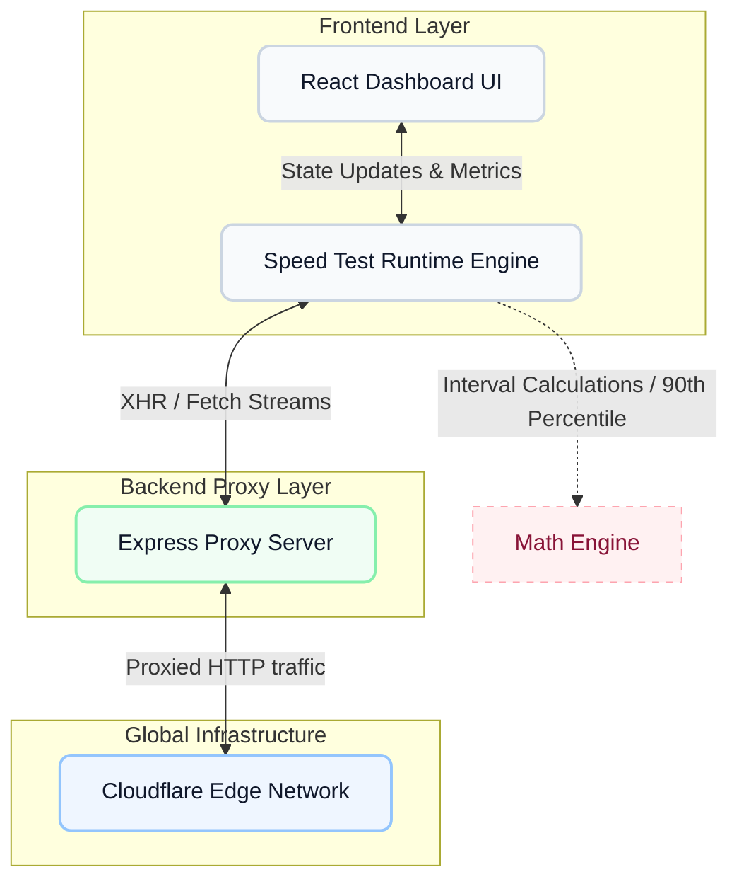

# PureNet

Welcome to PureNet — an enterprise-grade internet bandwidth diagnostic tool engineered to be mathematically precise, fiercely accurate, and completely transparent. 

## 📑 Table of Contents

- [About the Project](#about-the-project)
- [Features](#features)
- [Tech Stack](#tech-stack)
- [Installation](#installation)
- [Usage](#usage)
- [Project Structure](#project-structure)
- [How It Works](#how-it-works)
- [Metrics Explained](#metrics-explained)
- [Education Readiness](#education-readiness)

---

## About the Project

I built PureNet out of frustration. When looking at the landscape of speed tests, I saw a massive problem: they were either proprietary tools bloated with ads and trackers (like Speedtest.net), or they were open-source projects that calculated speeds using naive averages, leading to entirely inaccurate numbers. 

I set out to conquer the notorious "TCP Slow Start" limitation—the reason most browser-based tests fail to measure fast connections accurately. By reverse-engineering how enterprise diagnostics work, I built a mathematical engine that tosses out initial timeline anomalies and focuses strictly on your peak 90th percentile bandwidth. The result? PureNet doesn't just guess your speed; it proves it.

## Features

- **Blazing Fast Diagnostic Accuracy**: Calculates the **90th percentile** of sustained throughput rather than crude overall averages.
- **TCP Slow Start Check**: Intentionally discards the first 30% of data to prevent network ramp-ups from corrupting your final speed metrics.
- **Dynamic Scale-Out**: Automatically provisions from 2 up to 8 parallel HTTP streams on the fly to successfully saturate multi-gigabit fiber connections.
- **Massive Global Edge**: Tests directly against Cloudflare's sprawling global edge network, neutralizing long-distance routing bottlenecks.
- **Deep Latency Profiling**: Simultaneously measures raw ping and loaded bufferbloat during heavy bandwidth stress.
- **Zero Ads, Zero Tracking**: Pure, transparent, and completely open-source mathematics.

## Tech Stack

- **Frontend**: React 18, Vite, TypeScript, Tailwind CSS
- **Backend / Proxy**: Node.js, Express, HTTP-Proxy-Middleware
- **Deployment**: Multi-stage lightweight Docker Alpine
- **Infrastructure**: Proxied to the `speed.cloudflare.com` global edge

## Installation

You can deploy PureNet natively on your machine or launch it instantaneously utilizing our production-ready Docker container.

### Option A: Docker (Recommended)

The easiest way to get PureNet running is via Docker. I have authored a highly optimized, multi-stage image.

1. Ensure Docker is running.
2. Build the production image:
   ```bash
   docker build -t purenet:latest .
   ```
3. Run the container seamlessly in the background:
   ```bash
   docker run -d -p 3000:3000 --name purenet-server purenet:latest
   ```
4. Access the app: `http://localhost:3000`

### Option B: Local Development via GitHub

If you want to poke around the code or run it natively:

1. Clone the repository:
   ```bash
   git clone https://github.com/Mahesh-Kiran/PureNet.git
   cd PureNet
   ```
2. Install the necessary monorepo dependencies:
   ```bash
   npm install
   ```
3. Launch both the React client and the Express proxy backend concurrently:
   ```bash
   npm run dev
   ```
4. Access the dashboard at: `http://localhost:5173`

## Usage

Simply run the project, open it in your browser, and hit the **GO** button. The engine automatically handles stream provisioning, latency probing, and upload/download stress testing without needing manual server selection.

## Project Structure

PureNet is built as an NPM Workspace Monorepo:
- `/frontend`: The Vite + React dashboard, containing the speed calculation logic (`useSpeedTest.ts`), Contextual Engines, and UI components.
- `/backend`: The Node + Express proxy server, essential for bypassing strict browser CORS limitations on large data streams.
- `Dockerfile`: A unified multi-stage build that compiles the frontend, transpiles the backend, and serves both via a single Node container.

## How It Works

Here is a look at the system architecture and the data flow behind every speed test:



To conquer the unreliability of browser speed tests, the **Speed Test Runtime Engine** fetches a tiny probe file. Based on that probe, it opens multiple massive byte-streams with Cloudflare's servers (proxied through our Express backend to avoid CORS blocking). It records data transfer rates every 250ms, strips away the chaotic "slow-start" ramp-up segment, and computes the absolute peak bandwidth that your network maintained consistently.

## Metrics Explained

- **Download**: The rate your network can pull data from the global internet. Crucial for streaming content, pulling large repositories, or downloading game updates.
- **Upload**: The rate your network can push data *out*. Absolutely vital for crystal-clear video calls, cloud syncing, or live streaming.
- **Unloaded Latency (Ping)**: The physical round-trip time of a packet when your network is idle. Shows geographical distance to the server.
- **Loaded Latency (Bufferbloat)**: Your actual ping while your line is maxed out. If this spikes massively, your router struggles with traffic congestion (causing lag in games while someone else is watching Netflix).
- **Jitter**: The stability of your latency. High jitter means fluctuating response times, which causes audio dropouts during VoIP calls.

## Education Readiness

PureNet features an intelligent, contextual assessment engine. Instead of just throwing a number like "45 Mbps" at you and leaving you to google what it means, PureNet evaluates your combined metrics in real-time. 

After completing a test, the dashboard instantly confirms whether your line is mathematically stable enough for:
- Seamless Proctored Online Exams
- Heavy LMS platforms (Moodle, Canvas)
- Group Video Calls (Zoom/Meet/Teams) with multi-camera rendering
- Live Lecture HD Streaming
- Fast continuous file submissions and cloud backups

*Developed by Mahesh Kiran.*
