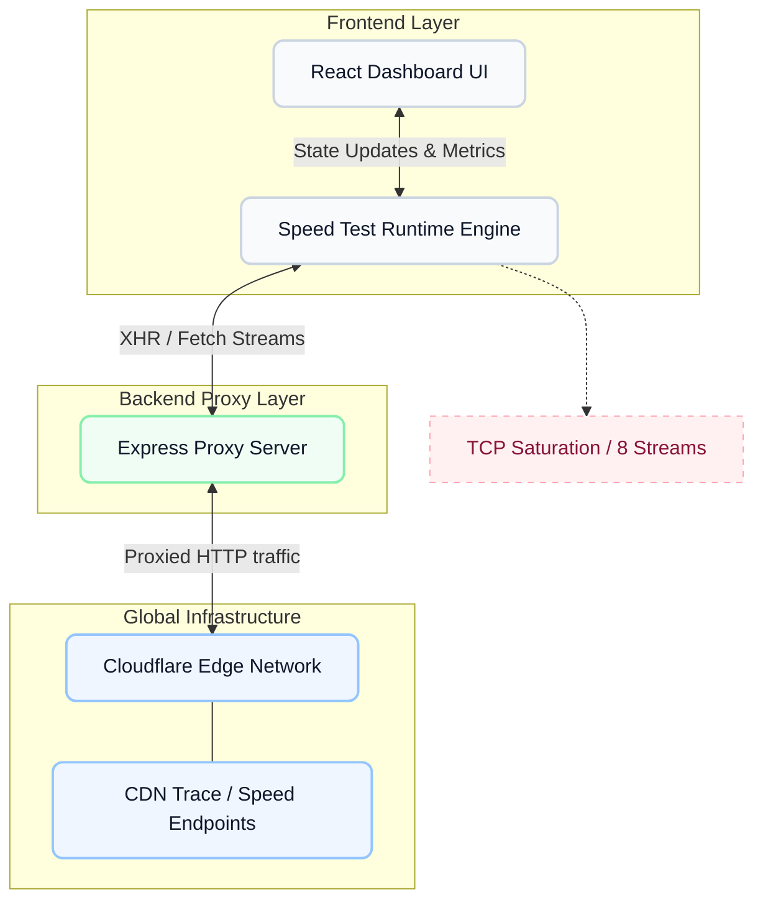

# PureNet

Welcome to PureNet — an internet bandwidth diagnostic tool engineered to be both mathematically precise and visually refined.

When analyzing open-source speed tests or trying to build one, I noticed a consistent gap: applications either prioritize accurate measurement at the expense of UI design, or they provide a beautiful interface but rely on inaccurate averages or restricted protocols. I built PureNet to serve as a genuine, enterprise-grade utility wrapped in a modern glassmorphism design system.

## System Architecture

I designed PureNet's architecture to measure network capacity directly against Cloudflare's Edge Network, bypassing artificial browser limitations. Here is the high-level data flow and system design:



### How it operates:
1. **The Client Runtime (Vite + React)**: The dashboard manages the visual state. Upon initiation, the client's internal engine launches an intense barrage of concurrent HTTP streams. 
2. **The Express Proxy Backend**: Browsers often restrict large cross-origin payload downloads if they aren't explicitly configured. To bypass this seamlessly without artificial throttling, we use a lightweight Node.js Express server to proxy the byte-stream endpoints.
3. **Cloudflare Global Edge**: Because Cloudflare maintains an endpoint close to nearly every major ISP, our backend proxies traffic instantly to your closest operational data center (`speed.cloudflare.com/__down`). This ensures the only bottleneck being measured is your ISP infrastructure, not a distant server routing hop.

## The Mathematics of Measurement

Most simplistic browser-based speed tests compute bandwidth across the entire continuous timeline: `(Total bytes downloaded) / (Total time)`. 
**This formula systematically corrupts runtime results.** 
Due to standard TCP congestion control logic, connections have a "slow start" phase where they gradually scale their sliding window to avoid packet loss. Absorbing that initial ramp-up drastically suppresses the final average.

PureNet employs the methodologies used by industrial diagnostic tools:
- It records instantaneous bandwidth throughput over rapid **250-millisecond intervals**.
- It intentionally discards the first 30% of the timeline to eliminate the TCP slow-start anomaly.
- It calculates the **90th Percentile** of your sustained operational speed.
- It dynamically provisions parallel connection streams (scaling from 2 up to 8 continuous streams) based on an initial probe, guaranteeing the test can saturate gigabit and multi-gigabit connections.

## Features & Competitive Comparison

The internet bandwidth measurement market is dominated by a few massive commercial entities. PureNet was built from the ground up to solve the distinct shortcomings observed in those platforms:

| Feature | PureNet | Fast.com | Speedtest.net | Typical React Projects |
|---------|---------|----------|---------------|------------------------|
| **Transparency** | Entire mathematical calculation open-sourced. | Fully proprietary, black-box equations. | Proprietary algorithms with heavy ad-tracking. | Uses crude mathematical averages; highly inaccurate. |
| **Data Source Limit** | Tests against Cloudflare's massive global Edge Network. | Restricted exclusively to Netflix servers. | Highly variable third-party volunteer servers. | Usually pings small personal backend routers. |
| **TCP Slow Start Check** | Discards initial 30% of TCP anomalies for true peak math. | Unknown (Internal tracking). | Unknown (Internal tracking). | Calculates overall average (fails on fast links). |
| **Contextual Analysis** | Translates raw digits into Real-World "Education Readiness". | Raw numbers only. | Raw numbers only. | Raw numbers only. |
| **UX Ecosystem** | Modern glassmorphism system with zero advertising. | Minimalist but rigid. | Ad-heavy, visually cluttered, distracting. | Usually relies on basic HTML templates. |

### Core System Features

- **Blazing Fast Diagnostic Accuracy**: Implements 90th percentile arithmetic and 250-millisecond observation windows to capture peak sustainable bandwidth, bypassing TCP slow start penalties.
- **Glassmorphism Interface**: A flexible 40/60 dashboard layout built heavily on composite CSS properties containing reactive hover states, yielding an intrinsically premium feel without being noisy.
- **Contextual Education Engine**: Translates raw megabit values into actionable assessments via a dedicated Education Readiness evaluation (e.g., verifying capability for live proctored exams vs. lightweight streaming).
- **Comprehensive Latency Profiling**: Captures both intrinsic unloaded ping (raw physical distance) and loaded bufferbloat measurements (router stress capabilities).

## Installation & Deployment

You can download and deploy the PureNet application locally on your machine or utilize our heavily optimized Docker container.

### Option A: Local Development (Node.js)

PureNet is constructed as an NPM workspace monorepo, requiring Node.js environments.

1. **Clone or Download the Repository:**
   ```bash
   git clone https://github.com/Mahesh-Kiran/PureNet.git
   cd PureNet
   ```
2. **Install the necessary dependencies:**
   ```bash
   npm install
   ```
3. **Initialize the development servers:**
   Run the command below in the core repository directory. This simultaneously starts the frontend client and the backend proxy concurrently using `concurrently`.
   ```bash
   npm run dev
   ```
4. **Access the application:**
   - The Vite Client is available at: `http://localhost:5173`
   - The API Proxy Server is available at: `http://localhost:4000`

### Option B: Production Orchestration (Docker)

I have authored a multi-stage `Dockerfile` configured strictly for production overhead reduction. It compiles the React application via Vite, transpiles the TypeScript server, and serves the unified bundle from a lightweight Alpine Node runtime environment without carrying over compilation dependencies. 

1. **Verify you have Docker installed and running.**
2. **Build the orchestrator image directly from the fundamental layer:**
   ```bash
   docker build -t purenet:latest .
   ```
3. **Execute and expose the runtime container:**
   ```bash
   docker run -d -p 3000:3000 --name purenet-server purenet:latest
   ```
4. **Access the unified production build:**
   Navigate your browser to `http://localhost:3000`.

---
*Developed by Mahesh Kiran utilizing React, operational analytics, and Cloudflare Edge.*
