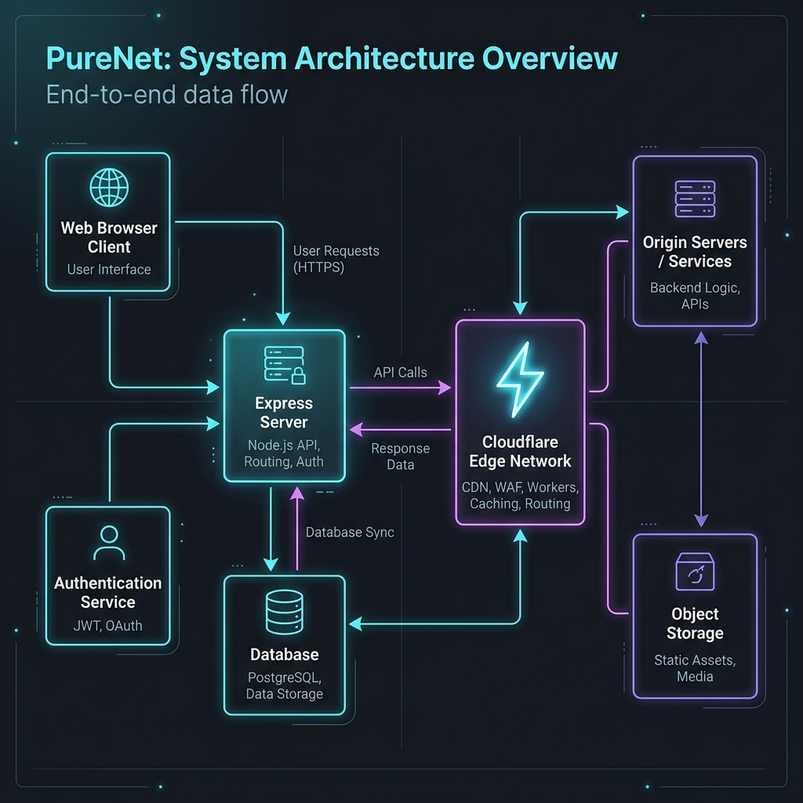

# PureNet

Hey there! 👋 Welcome to **PureNet** — an internet bandwidth diagnostic tool that I built to be *both* incredibly accurate and visually stunning. 

When looking at open-source speed tests or trying to build one, I noticed a huge gap: either the apps look terrible but work accurately, or they look beautiful but use fake, hardcoded numbers or highly inaccurate averages. I wanted to create something that feels like an enterprise-grade utility, dressed in a gorgeous, modern glassmorphism UI.

## 📸 Architecture

I engineered PureNet to actually measure your network directly against Cloudflare's Edge Network. Here's a high-level look at how it runs under the hood:

<div align="center">
  
</div>

### How it works:
1. **The Client (Vite + React)**: The dashboard you see on your screen. When you hit "GO", the client starts managing an incredibly intense barrage of parallel HTTP streams. 
2. **The Express Proxy Backend**: Browsers often block large, cross-origin file downloads strictly for speed tests. To bypass this seamlessly without losing speed, we use a Node.js Express server to proxy our raw blob endpoints.
3. **Cloudflare Edge**: Because Cloudflare has an endpoint practically in every city on Earth, our server proxies traffic instantly to your closest data center (`speed.cloudflare.com/__down`), ensuring the only bottleneck measured is *your* ISP, not a distant server. 

## 🚀 The Math: Why it's accurate
Most simple React speed tests calculate speed like this: `(Total bytes downloaded) / (Total time)`. 
**That mathematically ruins your results.** 
Why? Because TCP connections have a "slow start" phase where they gradually ramp up to avoid network congestion. Counting that slow ramp-up phase drastically pulls down your average.

PureNet does what the big players do:
- It tracks the data rolling in over **250 millisecond windows**.
- It tosses out the first 30% of the timeline to ignore the "slow start".
- It calculates the **90th Percentile** of your sustained download speed.
- It automatically shifts from 2 parallel streams up to **8 parallel streams** depending on how fast your initial probe is, ensuring we actually saturate gigabit connections.

## 🛠 Features

- **Blazing Fast Accuracy**: Matches real-world results against industry giants.
- **Glassmorphism UI**: A buttery smooth 40/60 dashboard layout with pulse animations and React portals for flawless hover tooltips.
- **Smart Capability Engine**: Don't know what "34 Mbps" means? PureNet tells you via dynamic chips ("4K Ready") and a dedicated **Education Readiness** panel that checks if you can stream lectures or handle proctored exams without dropping.
- **Latency Diagnostics**: Shows loaded vs. unloaded latency (your jitter and bufferbloat metrics).

## 💻 Running it locally

PureNet is built as a monorepo workspace.

1. Ensure you have Node.js 20+ installed.
2. Install the dependencies:
   ```bash
   npm install
   ```
3. Run the development server for both frontend and backend concurrently:
   ```bash
   npm run dev
   ```
4. The frontend will boot up on `localhost:5173` and the backend will start on `localhost:4000`. 

## 🐳 Docker Production Deployment

I've included a heavily optimized, multi-stage `Dockerfile`. It builds the React app, compiles the TypeScript server, and serves them both from a unified, lightweight Alpine Node runtime.

Build the container:
```bash
docker build -t purenet .
```
Run it:
```bash
docker run -p 3000:3000 purenet
```
Then visit `http://localhost:3000`.

---
*Built with ❤️ utilizing React, raw Mathematics, and the Cloudflare Edge network.*
